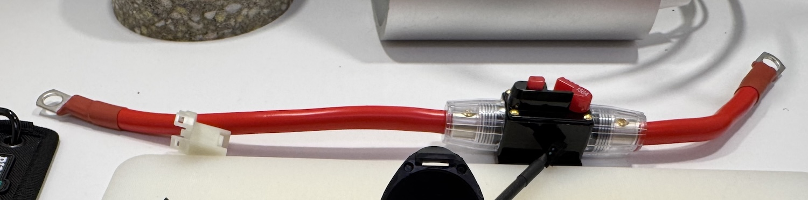
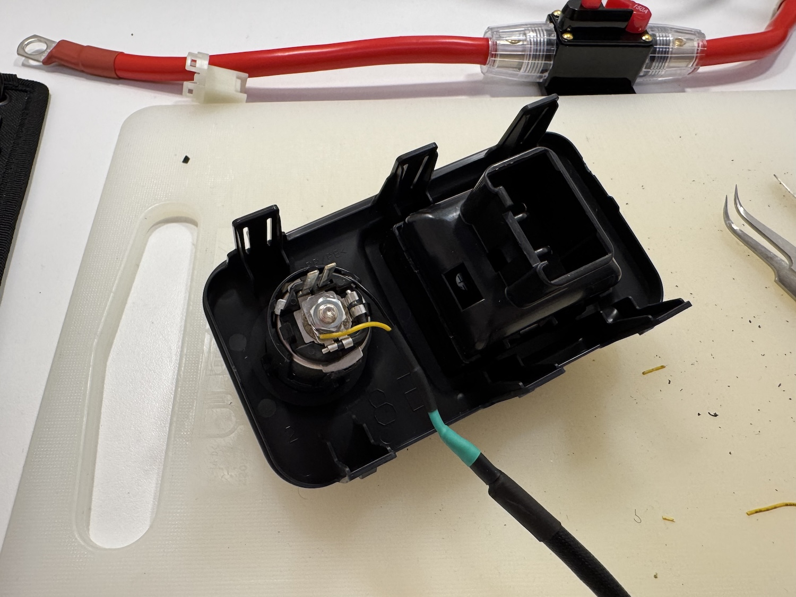
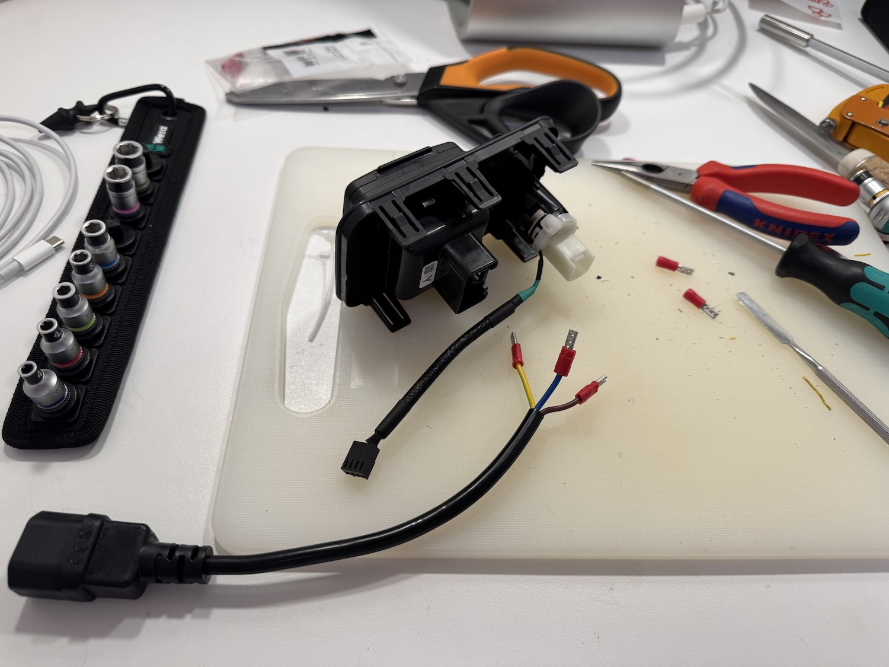
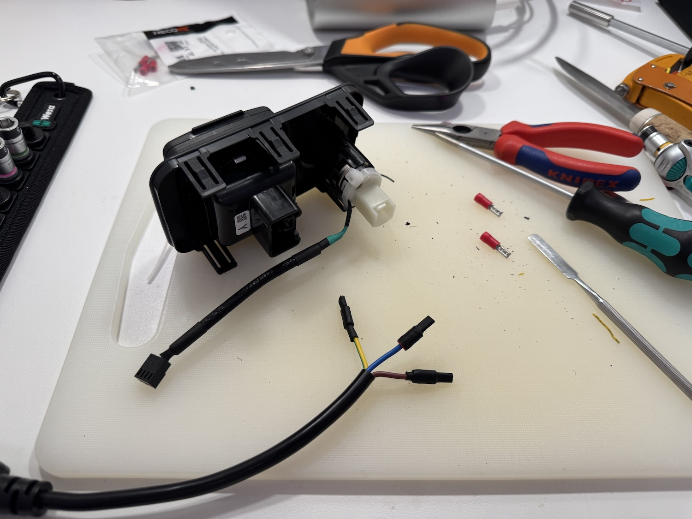
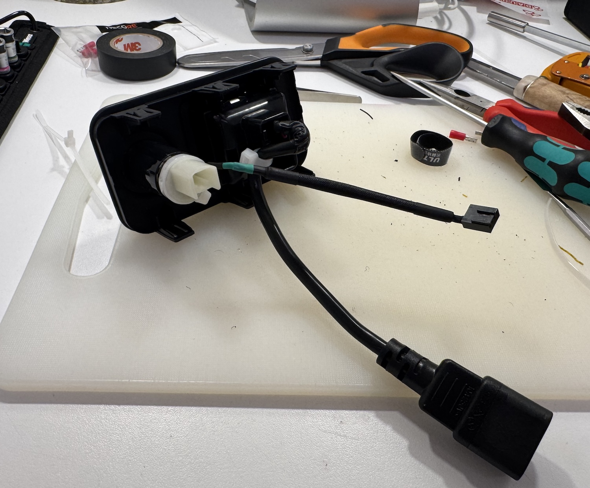
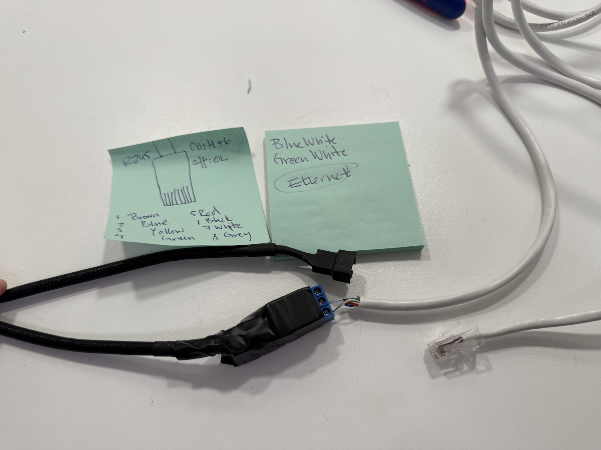
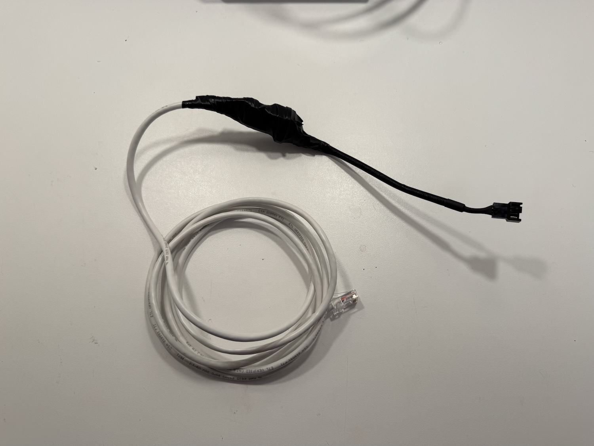
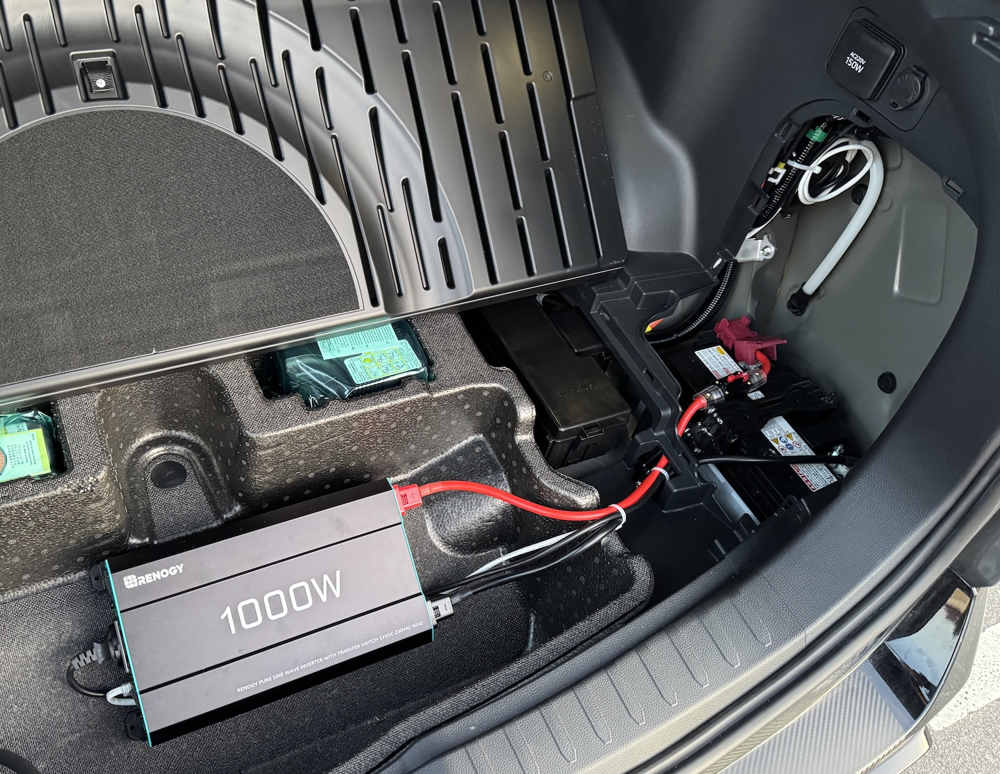
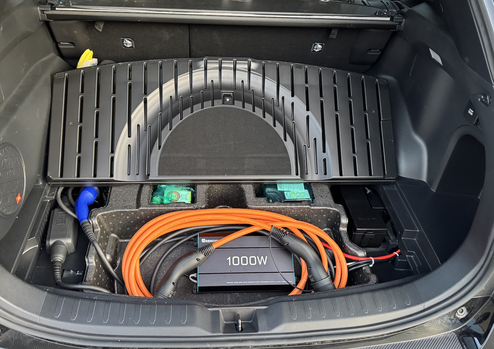
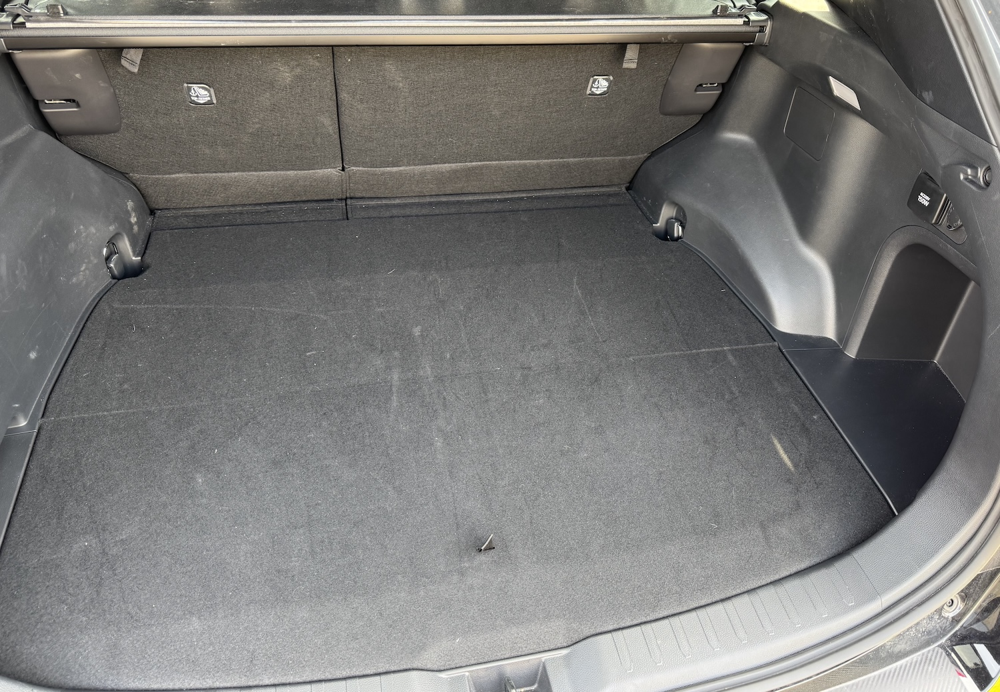

## 2025 RAV4 PHEV (EU Spec) – 150W to 1000W 230V Outlet Upgrade (Stock Look)

The US version of the 2025 Toyota RAV4 PHEV/Prime is equipped with a 1500W 110V AC outlet in the rear cargo area for higher trim levels.

The EU version provides only a 150W 230V AC outlet in the same location for equivalent trims.

At 150W, the outlet is of limited use, as some laptops can draw more power. While unconfirmed, some sources suggest this limitation is due to EU regulations.

This project upgrades the maximum output of the EU-spec rear AC outlet to 1000W using a 12V inverter, while retaining the stock appearance.

The build is fully reversible and non-destructive. Warranty issues are not anticipated; however, components can be removed before scheduled servicing as a precaution.

The inverter is positioned in the rear compartment designed for charging cable storage to ensure adequate airflow during operation.

Although the Victron 12/1200 Inverter is ideal due to its 12V trigger input for on/off control, the Renogy 1000W inverter was chosen here for cost reasons.

## The Plan

The US-spec inverter is connected to the high-voltage (HV) system. This project avoids modification of the HV system by connecting the new inverter to the 12V starter battery, located in the rear cargo area.

Output power is limited by the maximum current the vehicle’s DC-DC converter can provide when charging the starter battery, estimated at ~1250W. Power flows from the HV system through a DC-DC converter to the 12V battery.

The existing 230V Schuko outlet is reused, but its original thin wiring and proprietary connector are bypassed. A custom cable is connected directly to the outlet’s pins. As the outlet will only carry a load of ~4.4A (1000W ÷ 230V), its internal design is sufficient for the task.

Without control logic, the inverter operates regardless of vehicle state, risking 12V battery drain. Automatic on/off control is achieved by using the adjacent 12V cigarette lighter outlet as a trigger source. This outlet, along with the Schuko outlet, is powered only when the vehicle is in READY mode. An optocoupler or relay detects the 12V presence and signals the inverter to power on. When voltage drops to zero, the inverter shuts down.

While a relay could switch the inverter’s high-current input directly, it is safer and more reliable to use the inverter’s remote control interface. The Victron 12/1200 offers a dedicated trigger port; the Renogy 1000W uses a control board for the same purpose, reducing high-current wiring risks and allowing soft-start functionality on compatible units.

## Parts List

- Renogy 1000W 12VDC → 230VAC Inverter

- 35 mm² × 500 mm DC wiring with lugs (included with inverter)

- 150A in-line fuse for 12VDC

- 3pcs 2.8mm crimp connectors for the Schuko outlet

- Wire and IEC60320 C14 receptacle for the Schuko outlet

- AC power cable (Inverter → IEC receptacle)

- Low-voltage wiring (PC fan wiring used in this build)

- Low-voltage connectors (PC fan wiring used in this build)

- Optocoupler / relay for 12V power-on detection

- RJ45-terminated low-voltage wiring (Ethernet cable used in this build)

- Electrical tape, heat shrink tubing, zip ties

## The Build

### 12VDC High-Current Cable

The inverter’s supplied 500 mm cables with lugs are used.

The red cable is cut ~100 mm from one end, and a 150A fuse is installed in-line.

The black cable remains unmodified.

### 12VDC Low-Current Trigger Cable

Low-voltage wiring is attached to the 12V outlet without soldering by partially disassembling the outlet.

The cable is secured to the outlet’s plastic housing with a zip tie.

### 230VAC Outlet Cable

An IEC60320 C14 with cable is cut, and 2.8 mm flat-pin connectors are crimped to the conductors.

Heat shrink insulation is applied to each connector before they are fitted to the outlet pins.

The cable is fixed to the outlet housing with a zip tie.

### 12VDC Low-Current Cable with Relay and RJ45

The Renogy inverter’s remote control board connects via an RJ45 connector. When the remote switch is in the "on" position, pins 3 and 5 have continuity. In the "off" position, continuity is broken.

Using an Ethernet cable, the inverter is turned on by shorting the blue-white and blue-green wires.

At one end, the optocoupler/relay is connected to the 12V outlet cable with a polarity-protected connector. V, G, and trigger lines are connected (two wires used). Relay logic depends on the chosen device (trigger high or low).

At the other end, the relay output is connected to the Ethernet cable (white-blue and white-green to relay pins).

## Installation into the Car

1. Reinstall the outlet panel with modified 230V and 12V wiring.

2. With the fuse OFF, connect the red high-current cable to the battery (fuse near the terminal), then to the inverter.

3. Connect the black high-current cable from the battery to the inverter.

4. Connect the 230V cable from inverter to IEC receptacle.

5. Connect the 12V trigger cable to the inverter and the custom outlet trigger connector.

6. Replace the plastic trim

